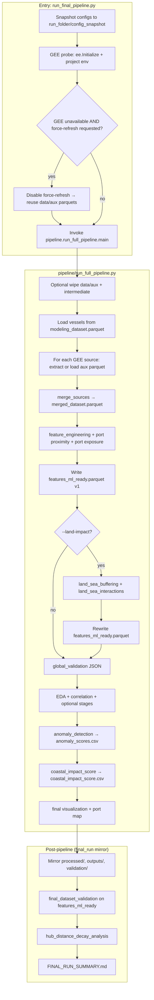
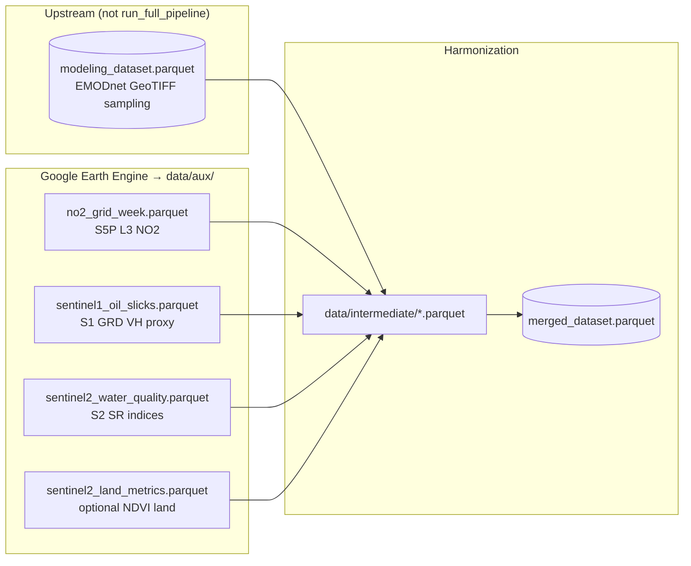
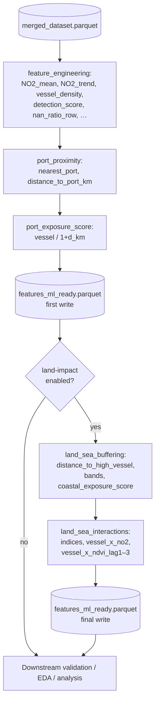
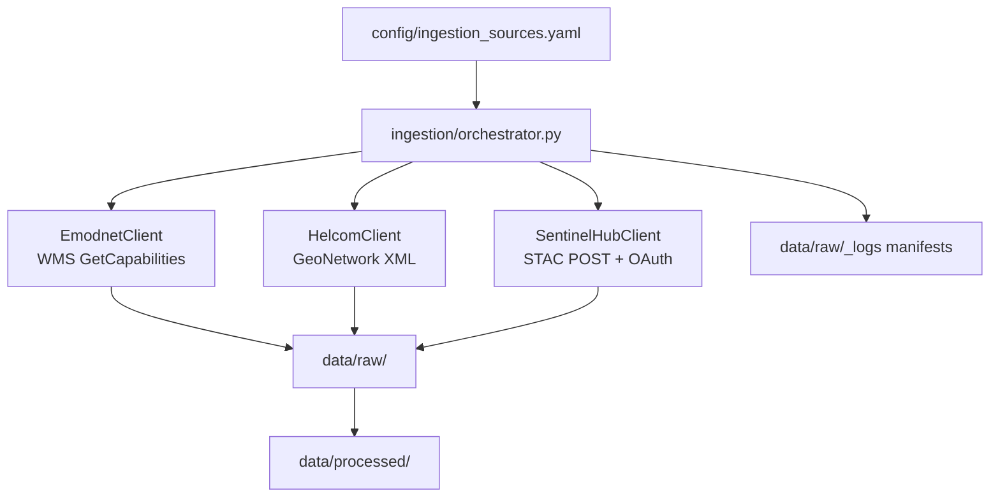
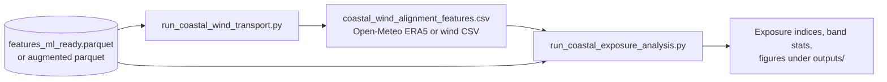

# Pipeline orchestration and architecture diagrams

Mermaid source for **Section 4** (or appendix). Render in [Mermaid Live Editor](https://mermaid.live), VS Code (Mermaid extension), GitHub-flavoured Markdown, or export to SVG/PNG from those tools.

---

## 1. End-to-end orchestration (`run_final_pipeline.py`)



---

## 2. Data acquisition and merge (operational ML path only)



---

## 3. Feature engineering order (after merge)



---

## 4. Parallel research ingestion (optional)

**Not** invoked by `run_full_pipeline.main()`. Separate entry: `python3 src/run_ingestion.py`.



---

## 5. Downstream coastal wind / exposure (manual or separate runs)



---

## 6. ASCII quick reference (orchestration spine)

```
run_final_pipeline.py
    │
    ├─► config_snapshot/
    ├─► gee_probe ──► (may fall back to cached data/aux/)
    │
    └─► pipeline.run_full_pipeline.main()
            │
            ├─► [vessels] modeling_dataset ──► intermediate/vessels.parquet
            ├─► [no2, s1, s2, land?] GEE ──► data/aux/*.parquet + intermediate/
            ├─► merge ──► processed/merged_dataset.parquet
            ├─► feature_engineering + ports ──► processed/features_ml_ready.parquet (v1)
            ├─► land_impact? ──► buffering + interactions ──► same parquet (final)
            ├─► validation ──► data/validation/*.json
            └─► EDA / correlation / anomaly / coastal score / viz ──► outputs/
    │
    ├─► mirror ──► final_run/ (or --run-name)
    ├─► final_dataset_validation
    ├─► hub_distance_decay_analysis
    └─► FINAL_RUN_SUMMARY.md
```

---

*Generated for thesis documentation. Adjust node labels to match your chapter terminology.*
